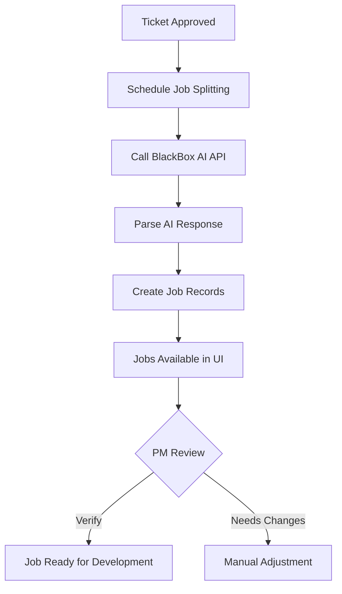

# Job Splitting Feature

## Overview

The job splitting feature automatically breaks down approved Jira tickets into smaller, manageable development jobs using the BlackBox AI API. When a ticket is assessed and approved, it triggers an automatic job creation process that divides the work into discrete, implementable tasks.

## How It Works

1. **Automatic Triggering**: When a ticket is assessed and approved (rejected = false), the system automatically triggers the job splitting process.

2. **AI-Powered Splitting**: The system sends the ticket details to BlackBox AI's Claude Sonnet 4 model with a specialized prompt framework that ensures consistent, high-quality job breakdowns.

3. **Job Creation**: Based on the AI's response, multiple job records are created in the database, each containing:
   - **Title**: A clear, concise description of the job
   - **Tasks**: Detailed implementation steps and acceptance criteria
   - **Relationships**: Links to the parent ticket and project

4. **Job Management**: Jobs can be:
   - Viewed alongside their parent ticket
   - Verified by project managers before development begins
   - Tracked through development with PR links and completion timestamps

## Splitting Framework

The AI uses these principles when splitting tickets:

1. **Independence**: Each job should be independently implementable
2. **Size**: Jobs should be completable in 1-2 days by a single developer
3. **Order**: Jobs are ordered by dependency (foundation first, then features)
4. **Clarity**: Each job has clear, measurable completion criteria
5. **No Overlap**: Avoid overlapping responsibilities between jobs

### Example Split

**Original Ticket**: "Implement Dark Mode Toggle"

**Generated Jobs**:

1. **Setup Theme Infrastructure**
   - Create theme context and provider
   - Setup CSS variables for colors
   - Implement theme detection logic

2. **Implement Toggle Component**
   - Create toggle UI component
   - Add keyboard accessibility
   - Connect to theme context

3. **Add Persistence Layer**
   - Implement localStorage integration
   - Handle SSR considerations
   - Add migration logic for existing users

## Configuration

The job splitting feature uses the same BlackBox AI API key as the assessment feature:

```env
BLACKBOX_API_KEY=your_api_key_here
```

## Implementation Details

### Files Created/Modified

1. **`convex/jobs.ts`**: Core job management logic
   - `splitTicketIntoJobs`: AI-powered ticket splitting action
   - `createJobsForTicket`: Database mutation for job creation
   - `listTicketJobs`: Query to fetch jobs for a specific ticket
   - `listProjectJobs`: Query to fetch all jobs in a project

2. **`convex/assessment.ts`**: Modified to trigger job splitting
   - Automatically schedules job splitting when ticket is approved
   - Runs asynchronously to avoid blocking assessment

3. **`convex/schema.ts`**: Database schema
   - `jobs` table with fields for title, tasks, verification, and completion tracking

### Job Splitting Flow



## Database Schema

Each job record contains:

```typescript
{
  ticketId: Id<"tickets">,      // Parent ticket reference
  projectId: Id<"projects">,    // Project reference
  title: string,                 // Job title
  tasks: string,                 // Implementation steps & criteria
  verifiedAt?: number,           // PM verification timestamp
  prId?: string,                 // GitHub PR ID when work begins
  finishedAt?: number,          // Completion timestamp
}
```

## Usage

### Automatic Job Creation

Jobs are created automatically when:

1. A new ticket is fetched from Jira
2. The ticket passes assessment (is approved)
3. The AI successfully splits the ticket

### Viewing Jobs

Jobs can be viewed:

- In the ticket detail view (showing jobs for that ticket)
- In the project dashboard (showing all jobs in the project)
- With their verification and completion status

### Job Lifecycle

1. **Created**: Job is generated from ticket
2. **Pending Verification**: Awaiting PM review
3. **Verified**: PM has approved the job scope
4. **In Progress**: Developer has started work (PR created)
5. **Completed**: Work is finished and merged

## API Endpoints

### Query Jobs for a Ticket

```typescript
const jobs = useQuery(api.jobs.listTicketJobs, {
  ticketId: ticket._id,
});
```

### Query All Project Jobs

```typescript
const jobs = useQuery(api.jobs.listProjectJobs, {
  projectId: project._id,
});
```

## Troubleshooting

### Jobs Not Being Created

- Check that the ticket was approved (rejected = false)
- Verify `BLACKBOX_API_KEY` is set correctly
- Check Convex logs for job splitting errors
- Ensure the ticket has sufficient detail for splitting

### Poor Job Quality

- Review the ticket description for clarity
- Ensure ticket includes technical requirements
- Check that acceptance criteria are well-defined
- Consider manual adjustment if needed

### Performance Considerations

- Job splitting runs asynchronously after assessment
- Each ticket's jobs are created in a single transaction
- No artificial delays between job creation
- Typical splitting takes 2-3 seconds per ticket

## Future Enhancements

- Manual job editing and refinement
- Job dependency management
- Effort estimation per job
- Auto-assignment to developers
- Integration with GitHub Issues
- Job templates for common patterns
- Bulk job operations
