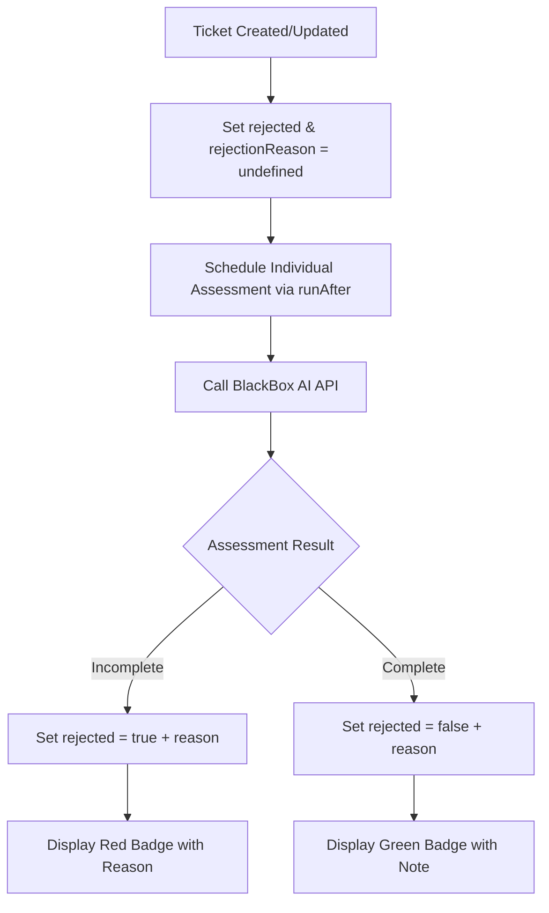

# Ticket Assessment Feature

## Overview

The ticket assessment feature automatically evaluates Jira tickets for completeness and clarity using the BlackBox AI API. When tickets are created or updated, they are assessed to determine if they contain sufficient information for developers to begin work.

## How It Works

1. **Automatic Triggering**: When tickets are fetched from Jira (either manually via "Sync with Jira" or automatically via daily cron), each new or updated ticket immediately triggers an individual assessment.

2. **AI Assessment**: The system sends each ticket's details to BlackBox AI's Claude Sonnet 4 model with examples of complete and incomplete tickets. Each ticket is assessed independently.

3. **Status Assignment**: Based on the assessment, tickets are marked as:
   - **Generating** (gray badge): Not yet assessed
   - **Rejected** (red badge): Lacks sufficient detail or clarity
   - **Approved** (green badge): Contains enough information to proceed

4. **Rejection Reason**: The AI provides a detailed explanation for its decision, which is displayed on the ticket card to help understand why a ticket was rejected or approved.

## Assessment Criteria

Tickets are **REJECTED** if they:

- Have vague or incomplete descriptions
- Lack acceptance criteria or success metrics
- Don't specify a clear technical approach
- Missing implementation details

Tickets are **APPROVED** if they:

- Have clear objectives and requirements
- Include specific acceptance criteria
- Provide enough detail for developers to start work
- Define the technical approach

## Configuration

### Environment Variable

Add your BlackBox AI API key to your `.env.local` file:

```env
BLACKBOX_API_KEY=your_api_key_here
```

### Getting an API Key

1. Visit [BlackBox AI](https://www.blackbox.ai)
2. Sign up or log in to your account
3. Navigate to API settings
4. Generate a new API key
5. Copy the key to your `.env.local` file

## Implementation Details

### Files Modified

1. **`convex/assessment.ts`**: Core assessment logic
   - Calls BlackBox AI API for individual tickets
   - Updates ticket rejection status and reason
   - Includes prompt with examples from `tickets.json`
   - No batch processing - each ticket assessed independently

2. **`convex/tickets.ts`**: Ticket management
   - Directly schedules assessment for each ticket on creation/update
   - Uses `scheduler.runAfter(0, ...)` for immediate background execution
   - Resets both `rejected` and `rejectionReason` when ticket content changes

3. **`components/TicketCard.tsx`**: UI display
   - Shows assessment status badge
   - Color-coded based on rejection status
   - Displays rejection reason or assessment note

4. **`convex/schema.ts`**: Database schema
   - `rejected` field: `undefined` (pending), `true` (rejected), `false` (approved)
   - `rejectionReason` field: Stores the AI's explanation for the assessment

### Assessment Flow



## Usage

### Manual Sync

Click the "Sync with Jira" button on the project dashboard to:

1. Fetch latest tickets from Jira
2. Create/update tickets in database
3. Trigger assessment for new/changed tickets

### Automatic Sync

A daily cron job runs to:

1. Sync all projects with their Jira sources
2. Assess any new or updated tickets

### Viewing Results

- Tickets display a badge indicating their assessment status
- **Gray badge**: Assessment pending
- **Red badge**: Ticket rejected (needs more detail)
- **Green badge**: Ticket approved (ready for development)
- **Rejection Reason**: Displayed below the badge, explaining why the ticket was rejected or approved

## Troubleshooting

### Assessment Not Running

- Check that `BLACKBOX_API_KEY` is set in environment variables
- Verify the API key is valid
- Check Convex logs for error messages
- Note: The BlackBox API endpoint is `https://api.blackbox.ai/` (not `/api/v1/chat/completions`)
- The API key may need to be passed in the request body rather than headers

### All Tickets Rejected

- Review the assessment criteria
- Ensure ticket descriptions include:
  - Clear requirements
  - Acceptance criteria
  - Technical approach

### Performance

- Each ticket is assessed independently and asynchronously
- No delays between assessments - all run in parallel
- Convex handles scheduling and execution automatically

## Example Ticket Formats

### Good Ticket (Will be Approved)

```
Title: Implement Dark Mode Toggle
Description: Create a theme toggle component that allows users to switch between light and dark modes.

Requirements:
- Toggle button in header
- Persist preference in localStorage
- Apply theme immediately without page refresh
- Support system preference as default

Acceptance Criteria:
- [ ] Toggle button visible in header
- [ ] Theme persists across sessions
- [ ] No flash of unstyled content
- [ ] Keyboard accessible (Space/Enter to toggle)
```

### Poor Ticket (Will be Rejected)

```
Title: Fix theme issue
Description: Theme doesn't work properly. Need to fix it.
```

## Future Enhancements

- Manual re-assessment trigger
- Bulk assessment actions
- Custom assessment criteria per project
- Assessment history tracking
- Detailed rejection reasons in UI
